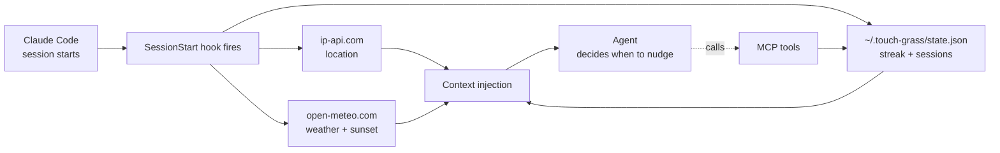

<div align="center">

# 🌿 touch-grass

**The Claude Code plugin that reminds you to go outside.**

Weather-aware · sunset-aware · session-aware · never interrupts your flow.

[](./LICENSE)
[](https://github.com/nalediym/touch-grass/stargazers)
[](https://github.com/nalediym/touch-grass/commits/main)
[](https://modelcontextprotocol.io)
[](https://claude.com/claude-code)

[Install](#install) · [How it works](#how-it-works) · [Tools](#mcp-tools) · [Privacy](#privacy) · [Site](https://touch-grass-xi.vercel.app)

</div>

---

```
$ claude

● Session started.

  🌿 Touch Grass Conditions

  72°F (22°C), clear outside in Brooklyn.
  ⚠  SUNSET IN 22 MINUTES. This is golden hour.
     If the user hits any natural pause, push them outside NOW.
  ✨ It's genuinely nice out. Suggest 🌅 catch the sunset.

  User's Grass Status
  🔥 3-day streak — needs to touch grass today to keep it alive.

───────────────────────────────────────────────────

> finish implementing the streak reset logic

● Done. Tests green. Before we move on — sunset in 18 min
  and your 3-day streak is on the line. Walk out the door
  now, catch the light, come back for code review.

> ...ok fine

● Using touch-grass → log_touch_grass(activity="sunset walk")
  🌿 Logged. Streak: 4 days. I'll be here when you get back.
```

## What it does

Like a Pomodoro timer, but it knows the weather, your sunset time, and your coding streak — and it talks to your AI agent instead of interrupting you.

- **SessionStart hook** injects live weather, sunset timing, and streak state into your agent's context every time a Claude Code session starts.
- **MCP server** exposes four tools your agent (Claude Code, Cursor, Claude Desktop, Codex) can call on demand.
- **Skill** teaches the agent when to nudge, when to stay quiet, and what tone to use (tiger mom, not preachy).

It's a Claude Code pomodoro replacement for people who'd rather have their coding agent tell them to go outside than have a screen-blocking timer break their flow.

## Install

**Claude Code** (full experience — hook + MCP + skill):

```bash
/plugin install nalediym/touch-grass
```

That's it. Open a new session — the hook fires, the context drops in, your agent takes it from there.

<details>
<summary><strong>Other MCP clients</strong> (Cursor, Claude Desktop, Codex) — MCP tools only, no proactive hook</summary>

```bash
git clone https://github.com/nalediym/touch-grass
cd touch-grass/plugin/mcp-server && npm install
```

Then add to your client's MCP config:

```json
{
  "mcpServers": {
    "touch-grass": {
      "command": "node",
      "args": ["/absolute/path/to/touch-grass/plugin/mcp-server/index.mjs"]
    }
  }
}
```

You get the four MCP tools but lose the SessionStart hook, which is Claude Code specific. Your agent will only bring up grass when you explicitly ask about it.

</details>

## How it works



On session start, a hook script runs. It detects your location from your public IP (cached 24h), fetches current weather and sunset time from open-meteo, reads your local streak file, and synthesises a short context block for the agent. The agent reads it, sits on it, and at a natural pause — feature done, bug fixed, waiting for input — nudges you outside with language that matches the actual conditions.

When you confirm you went outside, the agent calls `log_touch_grass` via the MCP server, which increments your streak in the local state file.

## MCP tools

| Tool | Purpose | Returns |
|---|---|---|
| `check_grass_conditions` | Weather, temperature, minutes until sunset, and the user's streak state. Decision context. | JSON block with `weather`, `sunset`, `isNice`, `minutesToSunset`, `state` |
| `suggest_activity` | Random activity recommendation, weighted by time of day. Golden hour gets sunset-specific suggestions. | Plain text like `"🌅 catch the sunset"` |
| `log_touch_grass` | Records that the user went outside. Updates their streak. Call only when confirmed. | Confirmation with new streak count |
| `get_stats` | Raw session telemetry and streak history. | JSON block |

All four are callable from any MCP-compatible agent. In Claude Code, the agent mostly uses them via the context the hook injects — you rarely need to call them manually.

## Example prompts

The plugin works ambiently, but these phrasings work well if you want to bring it up yourself:

- *"Should I touch grass right now?"*
- *"What's my streak?"*
- *"Remind me to go outside before sunset."*
- *"I just went for a walk, log it."*
- *"Is it nice out?"*

## Privacy

Everything is local-first.

- **Stored on your machine:** `~/.touch-grass/state.json` (streak, session counts, last touched date) and `~/.touch-grass/config.json` (cached location, weather threshold).
- **Leaves your machine:** your public IP is sent to `ip-api.com` once every 24 hours to resolve city coordinates, and those coordinates are sent to `api.open-meteo.com` on each session start to get weather and sunset.
- **Never leaves your machine:** your streak, your activity notes, your coding schedule, your prompts, anything from your Claude Code session.

No accounts. No API keys. No telemetry. No analytics. No auth. If you want to disable network access entirely, pin `"location"` manually in `~/.touch-grass/config.json` and the IP lookup never fires.

## Configuration

<details>
<summary>Override defaults in <code>~/.touch-grass/config.json</code></summary>

```json
{
  "location": {
    "lat": 40.7128,
    "lon": -74.0060,
    "city": "New York",
    "timezone": "America/New_York",
    "fetchedAt": 9999999999999
  },
  "niceWeatherThresholdC": 15,
  "breakIntervalHours": 2,
  "enabled": true
}
```

| Key | Default | Description |
|---|---|---|
| `location` | auto (ip-api) | Pin to a specific location. Set `fetchedAt` to a future timestamp to disable auto-refresh. |
| `niceWeatherThresholdC` | `15` | Temperature (°C) below which weather isn't considered "nice." |
| `breakIntervalHours` | `2` | After this many hours of continuous coding, nudges get firmer. |
| `enabled` | `true` | Set to `false` to silence the hook without uninstalling. |

</details>

## Development

```bash
git clone https://github.com/nalediym/touch-grass
cd touch-grass/plugin/mcp-server && npm install

# Test the hook directly (outputs JSON context)
node ../hooks/session-start.mjs

# Test the MCP server with the inspector
npx @modelcontextprotocol/inspector node ./index.mjs
```

Three moving parts:

- **`plugin/hooks/session-start.mjs`** — zero-dep Node script. Called by Claude Code on session start. Outputs JSON to stdout.
- **`plugin/mcp-server/index.mjs`** — MCP server. Uses `@modelcontextprotocol/sdk`. stdio transport.
- **`plugin/lib/grass.mjs`** and **`plugin/lib/nudge.mjs`** — shared logic (weather, sunset, state, nudge text).

The hook and the MCP server read from the same state file, so they stay in sync.

## Related

- [Claude Code plugin docs](https://docs.claude.com/claude-code/plugins)
- [Model Context Protocol](https://modelcontextprotocol.io)
- [open-meteo.com](https://open-meteo.com) — free, keyless weather API
- [ip-api.com](https://ip-api.com) — free, keyless IP geolocation

## License

[MIT](./LICENSE) · Built in the shade.

---

<div align="center">
  <sub>Your screen will be here when you get back. 🌱</sub>
</div>
